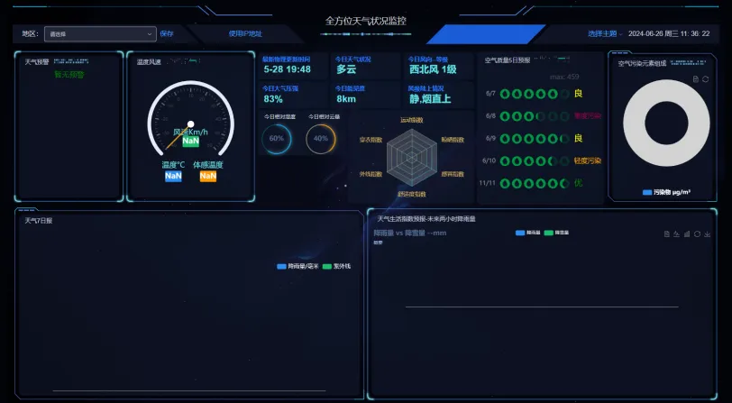
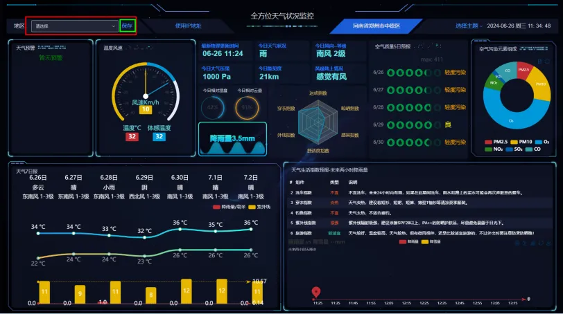
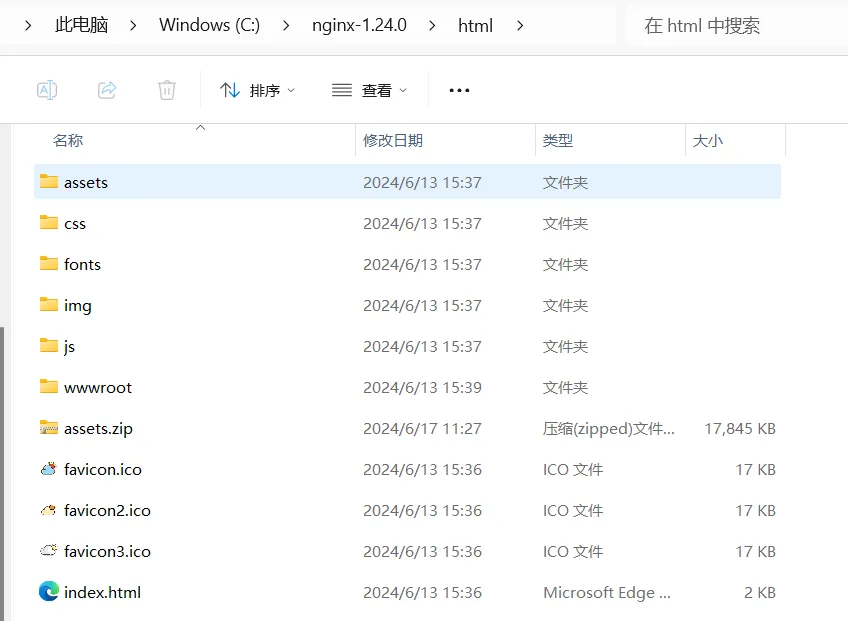

## 项目概述
本项目是一个基于天气预报数据的数据可视化大屏，旨在通过直观的图表展示天气信息，帮助用户更好地理解和分析天气趋势。基于 Vue2、Echart 框架、及少量的Datav的 " **数据大屏项目** "，通过 Vue 组件实现数据动态刷新渲染，内部图表可实现自由替换。
## 技术栈
- Vue2
- ECharts
- Datav
- GitHub
- Vercel
## 数据来源
数据来源于公开的天气预报**和风天气API**：[https://dev.qweather.com/docs/api/](https://dev.qweather.com/docs/api/) 通过 Axios 获取并处理。
## 可视化展示


- **由于部署无代理功能故进来后会看到这种界面需要选择地区后即可展示**



- **选择后的成功截图**



## 功能说明
### IP定位自动选择城市
用户首次进来会根据IP地址来自动选择地址及其他详细信息，然后根据城市信息获取城市的天气情况
### 城市切换
用户可以选择不同的城市查看对应的天气预报。
### 图表主题切换
用户可以切换不同类型的**主题**以查看不同的天气数据。
### 图表类型切换
用户可以切换不同类型的**图表**以查看不同的天气数据。

## 部署说明
### 本地运行-源码
1. 克隆项目：`git clone https://github.com/Luogoddes/air-weather.git`
2. 安装依赖：`npm install`
3. 启动项目：`npm run serve`
在`main.js`更换自己的API密钥，可以去申请免费的api密钥进行使用[https://id.qweather.com/#/register](https://id.qweather.com/#/register)
#### 封装组件渲染图表
所有的 ECharts 图表大多是基于 `common/echart/index.vue` 封装组件创建的，已经对数据和屏幕改动进行了监听，能够动态渲染图表数据和大小。在监听窗口小大的模块，使用了防抖函数来控制更新频率，节约浏览器性能。
项目配置了默认的 ECharts 图表样式（还可以自己添加主题样式），文件地址：`common/echart/theme.json`。
封装的渲染图表组件支持传入以下参数，可根据业务需求自行添加/删除。

| 参数名称 | 类型 | 作用/功能 |
| --- | --- | --- |
| id | String | 唯一 id，渲染图表的节点（非必填，使用了 $el） |
| className | String | class样式名称（非必填） |
| options | Object | ECharts 配置（必填） |
| height | String | 图表高度（建议填） |
| width | String | 图表宽度（建议填） |

#### 动态渲染图表
动态渲染图表案例为 `components` 目录下各个图表组件，index 文件负责数据获取和处理，chart 文件负责监听和数据渲染。
chart 文件的主要逻辑为：
```html
<template>
  <div>
    <Echart :options="options" id="id" height="height" width="width" ></Echart>
  </div>
</template>

<script>
  // 引入封装组件
import Echart from '@/common/echart'
export default {
  // 定义配置数据
  data(){ return { options: {}}},
  // 声明组件
  components: { Echart},
  // 接收数据
  props: {
    cdata: {
      type: Object,
      default: () => ({})
    },
  },
  // 进行监听，也可以使用 computed 计算属性实现此功能
  watch: {
    cdata: {
      handler (newData) {
        this.options ={
          // 这里编写 ECharts 配置
        }
      },
      // 立即监听
      immediate: true,
      // 深度监听
      deep: true
    }
  }
};
</script>
```
#### 复用图表组件
复用图表组件案例为中间部分的 `任务通过率与任务达标率` 模块，两个图表类似，区别在于颜色和主要渲染数据。只需要传入对应的唯一 id 和样式，然后在复用的组件 `components/echart/center/centerChartRate` 里进行接收并在对应位置赋值即可。
如：在调用处 `views/center.vue` 里去定义好数据并传入组件
```javascript
//组件调用
<span>今日相对湿度</span>
<centerChart :id="rate[0].id" :tips="rate[0].tips" :colorObj="rate[0].colorData" />

<span>今日云量</span>
<centerChart :id="rate[1].id" :tips="rate[1].tips" :colorObj="rate[1].colorData" />

...
import centerChart from "@/components/echart/center/centerChartRate";

data() {
  return {
    rate: [
      {
        id: "centerRate1",
        tips: 60,
        ...
      },
      {
        id: "centerRate2",
        tips: 40,
        colorData: {
          ...
        }
      }
    ]
  }
}
```
#### 更换边框
边框是使用了 DataV 自带的组件，只需要去 views 目录下去寻找对应的位置去查找并替换就可以，具体的种类请去 DavaV 官网查看
如：
```html
<dv-border-box-1></dv-border-box-1>
<dv-border-box-2></dv-border-box-2>
<dv-border-box-3></dv-border-box-3>
```
#### 更换图表
直接进入 `components/echart` 下的文件修改成你要的 echarts 模样，可以去[echarts 官方社区](https://echarts.apache.org/zh/index.html)里面查看案例。
#### Mixins 解决自适应适配功能
使用 mixins 注入解决了界面大小变动图表自适应适配的功能，函数在 `utils/resizeMixins.js` 中，应用在 `common/echart/index.vue` 的封装渲染组件，主要是对 `this.chart` 进行了功能注入。
#### 屏幕适配
1.5 版本项目放弃了 flexible 插件方案，将 rem 改回px，使用更流程通用的 `css3：scale` 缩放方案，通过 `ref` 指向 `views/index`，屏幕改变时缩放内容。项目的基准尺寸是 `1920px*1080px`，所以支持同比例屏幕 100% 填充，如果非同比例则会自动计算比例居中填充，不足的部分则留白。实现代码在 `src/utils/userDraw` ，如果有其它的适配方案，欢迎交流。
#### 请求数据
现在的项目未使用前后端数据请求，建议使用 axios 进行数据请求，在 main.js 位置进行全局配置。

- axios 的 main.js 配置参考范例（因人而异）
```javascript
import axios from 'axios';

//把方法放到vue的原型上，这样就可以全局使用了
Vue.prototype.$http = axios.create({
  //设置20秒超时时间
  timeout: 20000,
  baseURL: 'http://172.0.0.1:80080', //这里写后端地址
});
```
### 本地运行-打包文件
1. 克隆项目：`git clone https://github.com/Luogoddes/air-weather.git`
2. 下载nginx：`[https://nginx.org/en/download.html](https://nginx.org/en/download.html)`
3. 赋值dist到nginx里的html文件里

图
4. 修改nginx配置在`conf/config.conf`
```nginx
http {
  keepalive_timeout  65;  # keepalive 连接超时时间，客户端在该时间内没有新请求时连接会关闭
  server {
    listen       80;  # 监听端口号 80
    server_name localhost 127.0.0.1;  # 服务器名称为 localhost
    location /api-region/ {  #反向代理，没有这个无法进行ip检测
       proxy_pass https://uapis.cn/api/myip.php;
    }
    location / {
      root   C:/nginx-1.24.0/html;  # 设置根目录为 Vue 前端打包后的静态资源文件夹路径
      try_files $uri $uri/ /index.html;  # 尝试查找静态文件，如果找不到，则返回 index.html
      index  index.html index.htm;  # 设置默认首页文件名
    }
  }
}
```
5. 启动项目双击`nginx.exe`即可启动
我远程部署好的(但是没有反向代理故只能选择地址使用) -> [https://air-weather.nnds.eu.org/#/](https://air-weather.nnds.eu.org/#/)

### 部署到 Vercel
1. 将项目推送到 GitHub。
2. 在 Vercel 上导入 GitHub 仓库并进行部署。
3. 部署成功后由于国内某种原因只能外网访问故设置自定义域名使其国内可以成功访问。
## 使用指南
打开 [天气可视化](https://air-weather.nnds.eu.org/#/) 后，选择城市并查看天气预报数据。
## 常见问题
### 无法获取天气数据
请检查 API 配置是否正确，以及网络连接是否正常。
## 联系方式
如果有任何问题或建议，可以发issue